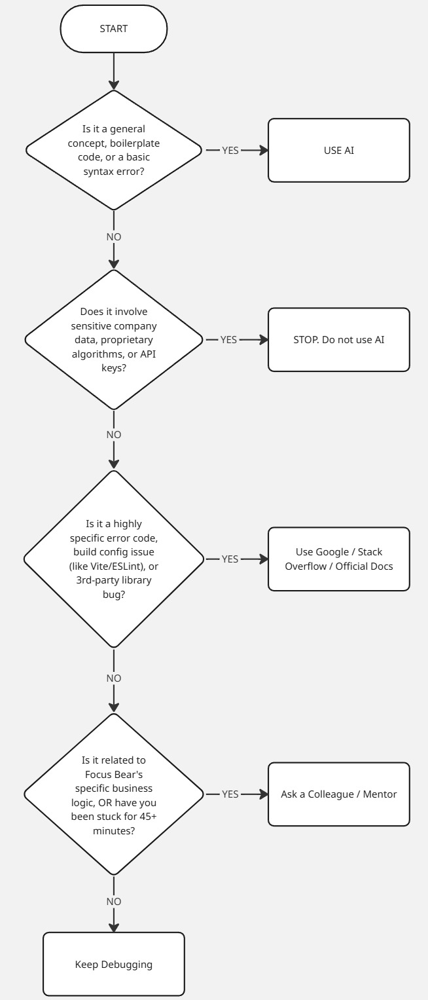

# Reflection

## Issue #35 When you get stuck - what next?

### Flowchart

### When do you prefer using AI vs. searching Google?

I prefer using AI when I need an interactive tutor. AI is incredibly fast for explaining broad or complex concepts (like how a specific Redux slice operates under the hood), generating repetitive boilerplate code, or translating a confusing, massive block of error text into plain English. It is great for the "why" and "how" of general programming.

I switch to Google (and by extension, Stack Overflow and official documentation) when dealing with highly specific, version-dependent issues. If I am fighting a strict configuration conflict with Vite, a very specific ESLint rule, or a bug in a brand new third-party library, Google is safer. AI can sometimes hallucinate or provide outdated syntax for tools that update frequently, whereas Google leads directly to the most current library docs or GitHub issue threads.

### How do you decide when to ask a colleague instead?

- **Domain Knowledge:** If a bug involves proprietary business logic, complex internal architecture, or sensitive data that cannot be pasted into a public AI tool, I will immediately consult a colleague. AI and Google cannot tell you why the company decided to structure a specific database the way they did.

- **Time (The Timeboxing Rule):** In an Agile environment, getting stuck blocks the whole team. If I have spent 45 to 60 minutes actively researching, prompting AI, and debugging without making any real forward progress, I stop and ping a colleague. Spending hours spinning my wheels on a blocked task is counterproductive.

### What challenges do developers face when troubleshooting alone?

The biggest challenge of solo troubleshooting is "tunnel vision" (or going down a rabbit hole). When you debug entirely on your own, it is very easy to get hyper-focused on fixing one specific line of code or one specific error message. You can spend hours trying to force a bad solution to work, completely missing the fact that the core architectural approach is flawed. Additionally, troubleshooting alone can lead to frustration and burnout. Often, a developer will spend hours stuck on a trivial typo or a minor syntax error that a fresh pair of eyes would have caught in ten seconds. Solo debugging removes the benefit of a sounding board.
